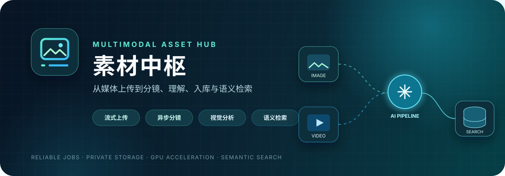
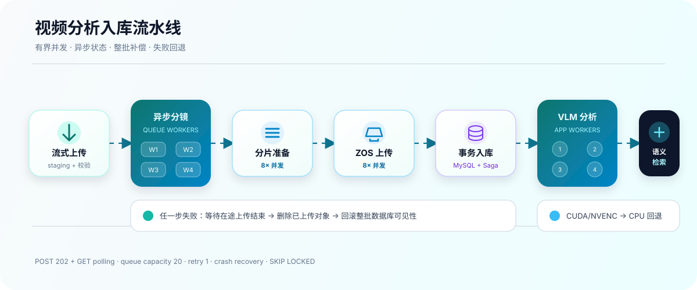

# 素材中枢

<p align="center">
  
</p>

<p align="center">
  
  
  
  
  
  
</p>

<p align="center">
  面向内部业务的多模态素材库：统一接收图片和视频，自动完成媒体校验、视频分镜、
  视觉分析、标签提取、对象存储与语义检索。
</p>

项目由 Next.js Web/API、MySQL 作业 worker、Chroma、私有 ZOS，以及内置的
`scene-detect-service` 分镜子模块组成。默认针对支持 NVIDIA NVENC 的单机部署优化。

## 功能

- 批量上传图片与视频，支持任务状态、逐项进度、失败重试和可靠回调。
- 图片正规化后写入私有 ZOS；视频先切成独立分镜，再作为素材分析和入库。
- VLM 自动生成描述与结构化标签，支持主模型及有序 fallback 候选链。
- MySQL 负责关系数据和可靠作业，Chroma 负责语义向量检索。
- 支持待审核、发布、修改、删除，以及个人素材与公共素材的作用域管理。
- 媒体接口支持私有文件代理、下载和 HTTP Range，不向浏览器暴露 ZOS 密钥。
- `dev`/`prd` 数据库目标硬隔离，启动和 Drizzle CLI 共用同一套安全校验。

## 技术栈

| 层级 | 技术 | 职责 |
| --- | --- | --- |
| Web 与 API | Next.js 15、React 19、TypeScript 5.9、Tailwind CSS 4 | 素材管理界面、Route Handlers、OpenAPI 文档 |
| 数据与作业 | MySQL 8.4、Drizzle ORM、`FOR UPDATE SKIP LOCKED` | 关系数据、migration、可靠异步作业与租约 |
| 视频分镜 | Python、FastAPI、PySceneDetect、FFmpeg | 异步场景检测、精确切片、状态轮询与崩溃恢复 |
| GPU 加速 | NVIDIA CUDA / NVENC | 视频硬件解码与 H.264 硬件编码，失败自动回退 CPU |
| 对象存储 | 电信云 ZOS、AWS S3 SDK | 私有父视频、分片、图片和缩略图存储 |
| AI 分析 | OpenAI-compatible VLM / Embedding API | 描述生成、结构化标签、模型 fallback |
| 语义检索 | Chroma | 分析结果向量化与受作用域约束的语义召回 |
| 工程质量 | Zod、Vitest、Playwright、Pytest、Ruff、ESLint | 配置校验、单元/集成/E2E 与静态检查 |

## 视频处理流程

<p align="center">
  
</p>

```text
上传 MP4
  → 本地 staging + 完整媒体校验
  → scene-detect-service 异步队列（4 个视频 worker）
  → PySceneDetect + FFmpeg/NVENC 精确分片
  → 下载、校验、抽取缩略图（每批最多 8 路并发）
  → 父视频、分片、缩略图上传 ZOS（最多 8 路并发）
  → 单个 MySQL 事务整批建档
  → 主应用作业池（4 路）并行调用 VLM
  → 分析结果写入 MySQL，向量写入 Chroma
```

分镜接口采用 `POST 202 + GET 轮询`，不会让上传请求一直阻塞。队列有容量上限，
满载时返回 503；任务状态落盘，服务重启会恢复 `queued`/`processing` 任务。客户端
超时、取消或失败时会主动删除远端任务目录。

ZOS 和 MySQL 无法共享事务，因此视频入库使用 Saga：所有对象上传完成后才提交一个
MySQL 事务；任一上传、校验或数据库操作失败，会等待在途上传结束并补偿删除整批对象。

## 快速开始

要求：Linux、Node.js 22+、pnpm 11.3+、FFmpeg/ffprobe、`uv`/`uvx`，以及可访问的
MySQL 8.4、ZOS 和 OpenAI-compatible 模型服务。

```bash
corepack enable
pnpm install --frozen-lockfile
cp .env.example .env

./scripts/start.sh
```

浏览器访问脚本输出的 Web 地址。停止全部托管进程：

```bash
./scripts/stop.sh
```

`start.sh` 会依次执行数据库目标安全检查、启动并等待 Chroma、启动分镜服务、执行
Drizzle migration、启动 Web 与 worker。任一服务异常会输出 `.run/` 中对应日志并终止，
不会继续执行后续步骤。

## dev 与 prd 数据库隔离

这是启动流程的硬约束，不只是注释约定。

| 模式 | 数据库 | 内部模型服务 | Web |
| --- | --- | --- | --- |
| `APP_MODE=dev` | 将 `DATABASE_URL` 的库名替换为 `DEV_DATABASE_NAME`；名称必须以 `_test` 结尾 | 保留 `.env` 中的远程地址，例如开发机访问 `183.147.142.111` | `next dev --turbo` |
| `APP_MODE=prd` | 使用 `DATABASE_URL` 中的正式库名；拒绝 `_test` 库，并把主机改为 `PRD_INTERNAL_SERVICE_HOST` | VLM、LLM、Embedding 主机改为 `PRD_INTERNAL_SERVICE_HOST`，部署到 183 服务器时即 `127.0.0.1` | `next start` |

当前开发配置应得到类似输出：

```text
Database target OK: mode=dev target=183.147.142.111:20014/assets_library_dev_test
```

可以在启动前单独确认，输出不会包含数据库密码：

```bash
pnpm db:check-target
```

安全边界：

- `dev` 连接非 `_test` 数据库时，应用、migration 和 Drizzle CLI 都会直接拒绝运行。
- `prd` 连接 `_test` 数据库时同样拒绝运行。
- `drizzle.config.ts` 不直接读取原始 `DATABASE_URL`，而是调用 `loadConfig()`，因此
  `pnpm db:generate` 等 Drizzle 命令与 `start.sh` 使用相同的最终目标解析。
- `start.sh` 在启动依赖和执行 migration 之前先运行 `db:check-target`。

推荐的开发配置：

```dotenv
APP_MODE=dev
PRD_INTERNAL_SERVICE_HOST=127.0.0.1
DATABASE_URL=mysql://<user>:<url-encoded-password>@183.147.142.111:20014/assets_library
DEV_DATABASE_NAME=assets_library_dev_test
TEST_DATABASE_URL=mysql://<user>:<url-encoded-password>@183.147.142.111:20014/assets_library_dev_test
```

`DATABASE_URL` 可以保留正式库名，因为 dev 解析时会强制替换库名；真正执行增、删、改、查
和启动 migration 的目标都是 `assets_library_dev_test`。正式部署必须显式设置
`APP_MODE=prd`。

## 关键配置

完整模板见 [.env.example](.env.example)。密钥只写入未提交的 `.env` 或部署平台 Secret，
不要写进 README、镜像或 Git 历史。

### 并发与分镜

```dotenv
DATABASE_POOL_SIZE=6
WORKER_CONCURRENCY=4
WORKER_ANALYZE_TASK_SOFT_LIMIT=2
SCENE_DETECT_WORKERS=4
SCENE_SEGMENT_CONCURRENCY=8
SCENE_PERSIST_CONCURRENCY=8

SCENE_DETECT_QUEUE_MAX_SIZE=20
SCENE_DETECT_QUEUE_MAX_RETRIES=1
SCENE_DETECT_TIMEOUT_MS=600000
SCENE_DETECT_POLL_INTERVAL_MS=1000

FFMPEG_HW_ACCEL=auto
FFMPEG_ENCODER_QUALITY=23
FFMPEG_ENCODER_PRESET=p4
```

Web 与 worker 是两个独立进程，会各自创建最多 6 条数据库连接。
数据库作业保持 4 个全局 worker；有多个视频等待分析时，每个任务最多占用 2 个
分析 worker，只有一个任务等待时可自动使用全部 4 个。新上传文件的 `validate`
作业优先领取，避免被上一条视频的大量分镜分析作业长时间阻塞。

`auto` 会实际编码一帧探测 NVENC，探测失败时回退 `libx264`。分镜服务固定使用一个
Uvicorn 进程，视频级并发由内部 4 个队列 worker 控制；不要再通过增加 Uvicorn workers
复制进程内队列。

### 模型与向量

```dotenv
VLM_PROTOCOL=openai_chat_completions
VLM_BASE_URL=http://183.147.142.111:30000/v1
VLM_API_KEY=<secret>
VLM_NAME=<primary-model-id>
VLM_FALLBACK_NAMES=<fallback-id-1>,<fallback-id-2>
VLM_ENABLE_THINKING=false
VLM_VIDEO_TIMEOUT_MS=120000
VLM_MAX_OUTPUT_TOKENS=1280
VLM_PRIMARY_BUDGET_MS=60000
VLM_TOTAL_BUDGET_MS=90000
VLM_FAST_RETRY_WINDOW_MS=5000
VLM_RETRY_COUNT=1
VLM_MAX_CONCURRENCY_PER_TARGET=2

EMBEDDING_BASE_URL=http://183.147.142.111:39999/v1
EMBEDDING_API_KEY=<secret>
EMBEDDING_MODEL=<model-id>
```

dev 保留上述远程地址。prd 部署到 183 服务器后会自动把 VLM、LLM 和 Embedding 主机
替换为 `127.0.0.1`，端口和路径保持不变。主模型与 fallback 合计最多 5 个。
单次视频请求仍有 120 秒保护，但主模型预算为 60 秒、全候选链路总预算为 90 秒；预算从
素材开始分析时计算，并包含同模型并发排队、首次请求、纯文本格式修复和 fallback。只有
5 秒内返回的 HTTP 5xx、429 或短暂网络中断才按 `VLM_RETRY_COUNT` 重试当前候选。模型输出
最多 1280 tokens，同一模型目标最多并发 2 个请求。

视频切片在分镜校验阶段会同步生成分析关键帧。分析 worker 优先复用这些本地帧，跳过
从 ZOS 重新下载切片、再次校验视频和 FFmpeg 二次抽帧；关键帧种子缺失时自动回退旧链路，
不改变 `/api/v1` 请求与响应格式。关键帧保持宽高比且最大宽度为 640px，JPEG 质量为
`q=4`；不足 10 秒的分镜最多取 3 帧，达到 10 秒后最多取 5 帧。每类标签最多 5 个，
key moments 最多 3 个、timeline 最多 5 段，visualSegments 在服务端由 timeline 派生。
模型会收到精确分镜时长，服务端保证 timeline 从 0 连续覆盖到真实结束时间，并按人物、
形式、场景的语义优先级去除跨分类重复标签。模型返回格式无效、分析文本夹杂英文，或仅凭
稀疏关键帧推断慢镜头/长镜头等不可靠摄影结论时，第二次请求只发送原始文本进行 JSON
修复，不会重新发送关键帧。

### 存储与生命周期

```dotenv
MEDIA_ROOT=./media
SCENE_SEGMENT_MAX_BYTES=10485760
STAGING_RETENTION_HOURS=24
TASK_RETENTION_DAYS=7

ZOS_API_ENDPOINT=<s3-compatible-api-endpoint>
ZOS_BUCKET=<private-bucket>
ZOS_ACCESS_KEY_ID=<secret>
ZOS_SECRET_ACCESS_KEY=<secret>
```

成功入库后本地 staging、分析下载文件和分镜工作区会立即清理。失败或未封存 staging
默认保留 24 小时；终态任务记录默认保留 7 天。完整父视频、分片和图片长期保存于 ZOS。

## API

完整文档见 [docs/api.md](docs/api.md)，OpenAPI 文件位于
[spec/contracts/openapi.yaml](spec/contracts/openapi.yaml)，运行后也可访问 `/docs`。

| 方法 | 路径 | 用途 |
| --- | --- | --- |
| `POST` | `/api/v1/uploads` | 创建批量上传任务 |
| `PUT` | `/api/v1/uploads/{task_id}/items/{item_id}` | 流式上传单个文件 |
| `POST` | `/api/v1/uploads/{task_id}` | 封存并启动处理 |
| `GET` | `/api/v1/tasks/{task_id}` | 查询任务和所有 item 状态 |
| `POST` | `/api/v1/assets/query` | 浏览、标签过滤与语义搜索 |
| `GET/PATCH/DELETE` | `/api/v1/assets/{asset_id}` | 查询、修改或删除素材 |
| `POST` | `/api/v1/assets/{asset_id}/publish` | 发布素材 |
| `POST` | `/api/v1/assets/{asset_id}/retry` | 重试失败分析 |
| `GET` | `/api/v1/media/{asset_id}` | 私有媒体流与下载 |

所有业务 API 使用 `/api/v1` 和 `snake_case`。当前应用面向可信内网，不提供登录或 API Key
鉴权；生产入口必须由反向代理、防火墙或上游身份系统限制，不能直接暴露到公网。

## 项目结构

```text
src/
  app/                 Next.js 页面与 Route Handlers
  components/          Web UI 组件
  server/
    api/v1/            API 服务层与契约适配
    db/                Drizzle schema、连接与 migration
    media/             媒体探测、正规化、抽帧
    model/             OpenAI-compatible VLM/LLM 客户端
    repositories/      MySQL 查询与 SKIP LOCKED 作业领取
    scene/             分镜客户端、下载校验与批次工作区
    services/          上传、分析、持久化和任务生命周期
    storage/           ZOS/S3 对象存储
  worker/              4 路数据库作业循环

scene-detect-service/
  app/api/             上传、轮询、下载、删除接口
  app/services/        队列、状态存储、PySceneDetect/FFmpeg

drizzle/               版本化 MySQL migration
scripts/               一键启动、停止及分镜服务入口
tests/                 unit、integration、e2e
docs/                  API 与设计文档
spec/                  OpenAPI、数据模型和验收说明
```

## 测试与构建

不访问数据库的日常验证：

```bash
pnpm typecheck
pnpm lint
pnpm test:unit
uv run --project scene-detect-service pytest -q
```

数据库集成测试和 E2E 测试会清空 `TEST_DATABASE_URL` 所指 `_test` 库中的业务表：

```bash
pnpm test:integration
pnpm test:e2e
pnpm build
```

测试入口会拒绝库名不以 `_test` 结尾的连接，但它仍会删除测试库数据。当前 dev 和测试若
共用 `assets_library_dev_test`，运行集成/E2E 前应确认其中没有需要保留的开发数据。上述测试
不会、也不允许操作正式 `assets_library`。

## 部署

生产服务器设置 `APP_MODE=prd` 后执行：

```bash
./scripts/start.sh
```

首次启动会构建 Next.js，随后复用 `.next`。MySQL migration 以数据库中的 Drizzle
迁移账本为准并幂等执行；schema 来源为 [src/server/db/schema.ts](src/server/db/schema.ts)。
服务日志和 PID 位于 `.run/`。

Dockerfile 可将同一镜像分别作为 Web 和 worker 运行，但 Chroma、MySQL、ZOS 与分镜服务
需要单独部署或挂载。当前完整单机部署的推荐入口仍是 `./scripts/start.sh`。
