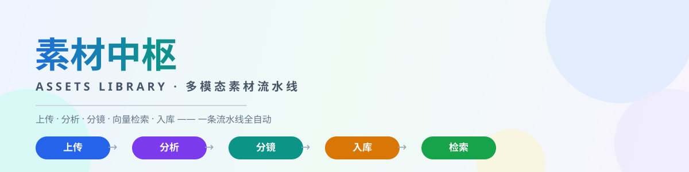
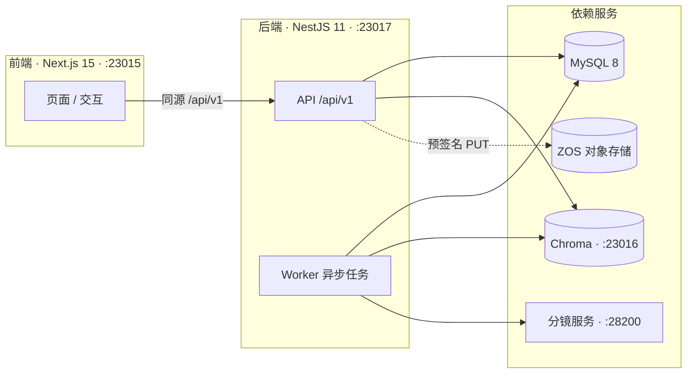

<p align="center">
  <picture>
    <source media="(prefers-color-scheme: dark)" srcset="docs/banner-dark.svg">
    
  </picture>
</p>

<h1 align="center">🧠 素材中枢 · Assets Library</h1>

<p align="center">
  <em>面向内部业务的多模态素材库 —— 上传、分析、分镜、向量检索、入库，一条流水线全自动；浏览器只认 HTTP，前端零后端耦合。</em>
</p>

<p align="center">
  <a href="https://github.com/HsiangNianian/assets-library/stargazers"></a>
  <a href="LICENSE"></a>
  
  
  
  <br>
  
  
  
  
  
  
  
  
</p>

---

## 🚀 它能做什么

把「上传 → 分析 → 分镜 → 入库 → 检索」整条素材处理链路做成一条**可横向扩展**的异步流水线：

- **前后端彻底解耦** — `frontend/`（Next.js 15）只负责页面、交互和调用 HTTP API，**不导入后端源码、数据库模型或存储 SDK**；浏览器只请求同源 `/api/v1`，Next.js 将 API、Swagger 和健康检查转发给内部 NestJS，Server Component 也通过 HTTP 调用 NestJS。
- **API 与 Worker 分进程** — `backend/`（NestJS 11 + Drizzle + Zod）负责 API、MySQL、ZOS、Chroma 和任务调度；`backend/src/worker.ts` 独立运行分析、分镜、入库、回调和清理任务。
- **MySQL 原子抢占** — 队列使用 MySQL 8 `FOR UPDATE SKIP LOCKED`；只有 worker-1 执行任务恢复、清理、callback 和 embedding 对账，避免维护作业重复入队。
- **视频分段并行** — `validate` → N 个 `analyze_segment` → `finalize`；多个 worker 可并行处理同一父视频的不同切片，失败重试只重新排队失败切片，成功切片绝不重复分析或分镜。
- **幂等 Embedding** — 切片成功后才创建正式 asset，并异步创建幂等 `embed` 作业，全部切片进入终态后由唯一 `finalize` 作业汇总。
- **预签名直传 ZOS** — 业务服务器不持久化媒体，浏览器通过 24 小时预签名 PUT 直传 ZOS。
- **语义检索** — Chroma 向量库支撑标签、描述与语义混合搜索。

任务状态一览：

| `status` | `phase` | 含义 |
| --- | --- | --- |
| `queued` | `uploading` | 等待前端用预签名 URL 直传 ZOS |
| `queued` | `processing` | 等待后端处理 |
| `running` | `processing` | 后端正在处理 |
| `failed` | `processing` | 处理失败，临时对象未过期时可重试 |
| `pending_review` | `pending_review` | 处理完成，等待手动入库 |
| `done` | `published` | 已入库（终态） |
| `done` | `expired` | 临时对象已过期（终态） |

> **状态模型**：`status + phase` 是唯一公开和数据库状态模型，不保留 `review_status`；终态任务保留 24 小时（`TASK_HISTORY_RETENTION_HOURS` 可调）。

---

## 🏗️ 系统拓扑

| 服务 | 默认监听 | 说明 |
| --- | --- | --- |
| Next.js | `0.0.0.0:23015` | **唯一对外端口**，页面和 API 同源 |
| NestJS | `127.0.0.1:23017`（可配 `0.0.0.0`） | 内部 API，由 Next.js 转发 |
| Chroma | `0.0.0.0:23016` | 应用通过 `127.0.0.1:23016` 访问 |
| 分镜服务 | `127.0.0.1:28200` | 现有独立服务，保持原端口 |



> ⚠️ Chroma 按项目既有方式监听全部网卡。部署环境应使用**防火墙或安全组限制 `23016`**，不要直接暴露到不可信网络。

### 子路径部署

在**构建前**设置 `NEXT_PUBLIC_BASE_PATH（Next.js 构建期变量，镜像启动后再修改不生效）。Next.js 不设置 `basePath`，但会同时接受带前缀和已由外层代理剥离前缀的请求，并为静态资源、页面链接和浏览器 API 请求拼接此前缀GitHub tag 镜像固定使用 `/feisu/assets-library` 构建。

---

## ⚡ 快速开始

### 环境要求

- Linux、Node.js 22+、pnpm 11.3+
- FFmpeg / ffprobe
- `uv` / `uvx`（一键脚本用于启动固定版本 Chroma）
- MySQL 8.0+（worker 使用 `FOR UPDATE SKIP LOCKED`）、ZOS、VLM/embedding 服务
- 现有 `scene-detect-service`（默认位于相邻目录，或 `SCENE_DETECT_PROJECT_DIR` 指定）

初始化：

```bash
corepack enable
pnpm install --frozen-lockfile
cp .env.example .env
```

> 🔒 真实数据库连接、ZOS 密钥和模型令牌**只能**放在未提交的 `.env` 或部署平台 Secret 中。Compose 使用 `DATABASE_SSL_CA_HOST_PATH` 将宿主 MySQL CA 单文件只读挂载到容器，不会把整个 `data/` 打进镜像。`.env.example` 保留独立 `LLM_*` 配置供后续纯文本链路使用；当前图片和视频分析使用 `VLM_*`。

### 一键启动 / 停止

```bash
./scripts/start.sh
./scripts/stop.sh
```

- `APP_MODE=prd`（默认）：按需构建并启动 Chroma、分镜、NestJS、worker、Next.js；
- `APP_MODE=dev`：开发监听模式；
- 重复执行启动脚本时，已健康的进程不会被重复启动或无条件重建；
- Next 开发产物固定写入 `.next-dev`，生产构建写入 `.next-prod`，运行开发服务时执行生产构建不会覆盖其 manifest。

### 数据库迁移

```dotenv
RUN_DATABASE_MIGRATIONS=true
```

> 只接受字面量 `true` / `false`。`true` 时在 backend/worker 启动前执行已提交的 Drizzle migration，失败会中止并回收本次新进程；`false` 时日志明确记录跳过。**不会**执行 `drizzle push`，也不会由 backend 或 worker 隐式迁移。

### 实时日志

所有一键启动进程的日志统一写入项目根目录 `.run/`：

| 日志 | 内容 |
| --- | --- |
| `frontend-YYYY-MM-DD.log` | 页面动作、API 步骤、上传进度、任务阶段变化和耗时 |
| `backend-YYYY-MM-DD.log` | 请求开始、完成、失败、HTTP 状态和耗时 |
| `worker-YYYY-MM-DD.log` | 任务领取、分析、分镜、Chroma、入库、回调和清理 |
| `chroma-YYYY-MM-DD.log` / `scene-YYYY-MM-DD.log` | 依赖服务日志 |

每个服务同时有稳定的 `<service>.log` 链接指向当天文件。浏览器操作使用同一个 `operation_id` 贯穿前端、API 和任务轮询；日志写盘前会脱敏 Authorization、Cookie、数据库连接串、访问密钥和预签名 URL 参数，不记录文件内容或原始 `user_id`。

```bash
tail -f .run/frontend.log    # 前端
tail -f .run/backend.log     # API
tail -f .run/worker.log      # 异步任务
tail -f .run/{frontend,backend,worker}.log   # 同时查看
```

---

## ⚙️ 配置

### 日志与观测

```dotenv
LOG_RETENTION_DAYS=7
LOG_CLEANUP_INTERVAL_SECONDS=3600
SLOW_OPERATION_MS=1000
OBSERVABILITY_EVENTS_PER_MINUTE=3000
```

清理器只删除过期的按日日志，不删除 PID、worker heartbeat 或当前日志。

### Worker 扩缩

```dotenv
WORKER_INSTANCES=3        # 本地 1–16 个 worker
WORKER_DATABASE_POOL_SIZE=5
WORKER_STALE_SECONDS=300
WORKER_MAINTENANCE_SECONDS=60
```

- 每个 worker 使用独立连接池，健康检查要求配置数量的心跳全部存活；
- 队列使用 MySQL 8 `FOR UPDATE SKIP LOCKED` 原子抢占；只有 worker-1 执行维护循环；
- Compose 当前固定单 worker；容器横向扩容应使用能为每个副本分配唯一 `WORKER_INDEX` 的编排系统。

### 临时上传配额

```dotenv
TEMP_UPLOAD_BATCH_MAX_BYTES=209715200
TEMP_UPLOAD_DISK_QUOTA_BYTES=1073741824
TEMP_UPLOAD_MAX_ACTIVE_FILES=32
TEMP_UPLOAD_IP_REQUESTS_PER_MINUTE=120
TEMP_UPLOAD_USER_REQUESTS_PER_MINUTE=60
```

> 🛡️ 生产请执行 `openssl rand -hex 32` 生成 `TEMP_UPLOAD_AUDIT_SALT` 写入未提交的 `.env`。

---

## 📡 API 一览

完整规范见 [docs/api.md](docs/api.md)，重构边界和决策见 [docs/refactor-plan.md](docs/refactor-plan.md)。运行后可访问：

- Swagger UI：`/api/docs`
- OpenAPI JSON：`/api/v1/openapi`
- 健康检查：`/health`

| 方法 | 路径 | 用途 |
| --- | --- | --- |
| `POST` | `/api/v1/temporary-files` | 独立同步临时上传，最多 9 图或 1 个 MP4；当前素材库前端不调用 |
| `POST` | `/api/v1/uploads` | 创建永久上传批次并取得 ZOS 预签名 URL |
| `POST` | `/api/v1/uploads/complete` | 通知直传完成并开始校验/分析 |
| `GET` | `/api/v1/tasks` | 查询单任务或按用户查询待入库批次 |
| `POST` | `/api/v1/assets/list` | 已入库素材列表与筛选 |
| `POST` | `/api/v1/assets/search` | 标签、描述和语义搜索 |
| `GET` | `/api/v1/assets/detail` | 已入库素材详情和完整分析结果 |
| `PATCH` | `/api/v1/assets/update` | 增量修改自己的素材 |
| `POST` | `/api/v1/assets/publish` | 手动入库单张图片或单个视频切片 |
| `POST` | `/api/v1/assets/retry` | 重试失败的处理任务 |
| `DELETE` | `/api/v1/assets/delete` | 软删除个人素材或硬删除公共素材 |
| `POST` | `/api/v1/storage/usage` | 返回文件数量和字节汇总 |

> 👤 **归属模型**：本版本暂不提供登录/JWT。`user_id` 由前端提供：空值或未填写表示公共素材，非空表示个人素材。该模型只适用于**可信内网**；开放到不可信客户端必须由网关或受信身份令牌派生 `user_id`。
>
> 🌐 跨域部署时将允许的完整 Origin 以英文逗号写入 `FRONTEND_ORIGIN`，不要使用通配符开放到公网。生产入口应在反向代理设置请求体大小、上传并发和来源 IP 限速；NestJS 审计限流是应用层第二道保护，不能替代网关配额。本地临时上传还受 `TEMP_UPLOAD_BATCH_MAX_BYTES`、`TEMP_UPLOAD_DISK_QUOTA_BYTES` 和 `TEMP_UPLOAD_MAX_ACTIVE_FILES` 三项磁盘配额保护。

---

## 🗄️ 存储与生命周期

- **不持久化二进制** — 业务服务器不存媒体；MySQL 只保存 ZOS 对象引用、直链、字节数、分析结果和素材关系。
- **预签名直传** — 永久上传由浏览器通过 24 小时预签名 PUT 直传 ZOS；预签名未绑定 `Content-Type`，前端 PUT 不得自行补该请求头。
- **格式白名单** — 图片仅 JPG/JPEG、PNG、WebP，每张 ≤ 20 MiB；视频仅真实 MP4、≤ 200 MiB；均不限制分辨率。
- **目录分工** — 临时对象位于 `tmp/test_assets/`（`ZOS_TMP_PREFIX`），由 bucket lifecycle 1 天后过期；长期对象位于 `test_assets/`（`ZOS_PERMANENT_PREFIX`）。
- **CORS 要求** — ZOS bucket CORS 必须允许实际前端 Origin 的 `PUT`，并暴露预览/下载所需的 `GET`、`HEAD`、`Range`、`Content-Type`、`Content-Length`。
- **视频切片关系** — 父视频只在 `tmp/` 中参与分镜；素材库长期保存选中切片及其封面，`video_source_id` 仅记录来源关系。
- **手动入库**只处理一个切片及其封面；`auto_publish=true` 的视频整批原子入库。
- 临时同步上传由 NestJS 完成格式、完整解码、大小及视频封面校验后通过 `ZosService.putTemporary()` 直接写入 ZOS，不依赖额外 Spring 服务，也不写 MySQL。

---

## 📦 Docker 与镜像

同一个镜像包含 frontend、backend 和 worker，`compose.yaml` 先运行一次性 migration 角色，再启动三个独立长期角色，避免 worker 在迁移期间消费任务。分镜服务仍由现有外部项目在 `28200` 提供，启动 Compose 前需保证它已可用。

```bash
docker compose build
docker compose up -d
```

GitHub Actions 只在推送 Git tag 时构建并发布 GHCR 多架构镜像；Pull Request 和普通分支提交不会构建镜像。

---

## 🧪 验证

```bash
pnpm typecheck
pnpm lint
pnpm test
pnpm build
```

> ⚠️ 没有真实 MySQL、ZOS、VLM、Chroma 和分镜环境时，上述命令只能验证静态契约和构建；发布前仍需在集成环境完成完整上传、分析、入库、回调、过期和删除链路测试。

---

## 🔗 相关链接

- 📖 完整 API 规范 → [`docs/api.md`](docs/api.md)
- 🧭 重构边界与决策 → [`docs/refactor-plan.md`](docs/refactor-plan.md)
- 🐳 Compose 编排 → [`compose.yaml`](compose.yaml)

---

## 📜 License

[](LICENSE)

MIT © 简律纯 · YiHarvest
