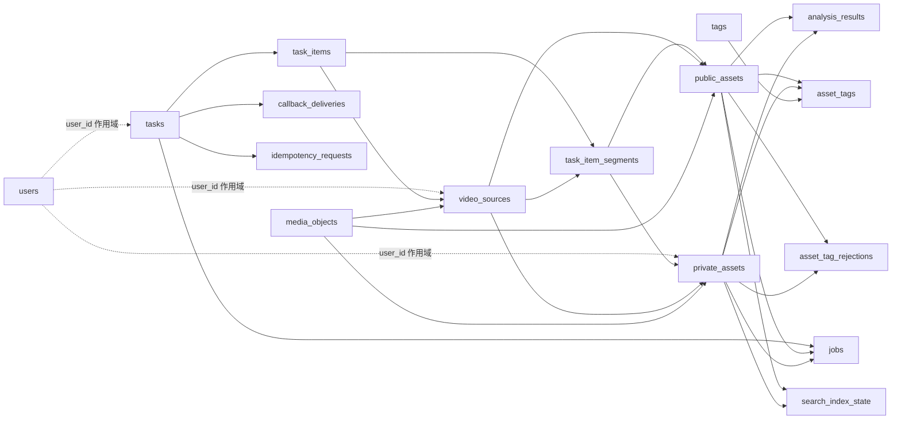

# `assets_library` 数据库字典

本文档说明素材库数据库的表、字段、关系和状态值，供 Metabase 数据浏览、查询编写和故障排查使用。

- 核对环境：目标 Metabase 数据源（数据库 ID 以部署配置为准）
- 数据库：MySQL 8.4
- 范围：17 张当前应用表、1 张 Drizzle 迁移表、5 个运行时统一视图、2 个报表视图
- 结构来源：生产库 `information_schema` 与 [`src/server/db/schema.ts`](../../../src/server/db/schema.ts)

> 所有业务时间均按 UTC 写入 MySQL 的 `datetime(3)` 字段。Metabase 以 `Asia/Shanghai` 展示时，需要注意查询条件中的时区转换。公共素材存放在 `public_assets`，私人素材存放在 `private_assets`。

## 表目录

| 分类 | 表 | 用途 |
| --- | --- | --- |
| 用户 | `users` | 应用观察到的用户 ID、活动时间及预留资料 |
| 素材核心 | `public_assets` | 公共审核、浏览和检索的图片或视频切片 |
| 素材核心 | `private_assets` | 用户个人图片或视频切片，与公共副本相互独立 |
| 素材核心 | `analysis_results` | 公私素材各自的模型分析结果 |
| 素材核心 | `tags` | 规范化标签字典 |
| 素材核心 | `asset_tags` | 素材与标签的多对多关系 |
| 素材核心 | `asset_tag_rejections` | 人工拒绝过的模型标签，防止重新补回 |
| 媒体存储 | `media_objects` | 本地或 ZOS 中的真实媒体对象 |
| 媒体存储 | `video_sources` | 上传的完整父视频及其处理状态 |
| 媒体存储 | `task_item_segments` | 父视频分镜切片清单 |
| 异步任务 | `tasks` | 对外异步操作的任务主表 |
| 异步任务 | `task_items` | 上传任务中的单个原始文件 |
| 异步任务 | `jobs` | Worker 可抢占的内部作业队列 |
| 异步任务 | `callback_deliveries` | 任务回调的逐次投递记录 |
| 一致性 | `idempotency_requests` | API 幂等键与任务响应缓存 |
| 一致性 | `outbox_events` | 事务内可靠事件及异步投递状态 |
| 检索 | `search_index_state` | MySQL 与 Chroma 向量索引的一致性水位 |
| 迁移 | `__drizzle_migrations` | Drizzle 已执行迁移的内部历史 |
| 报表 | `reporting_database_tables` | 所有基础表的用途和实时精确行数 |
| 报表 | `reporting_user_assets` | 用户汇总、素材明细和父视频切片统计 |

## 主要关系

删除规则分为两类：任务明细等临时追溯关系多使用 `SET NULL`，保留素材本体；强归属明细多使用 `CASCADE`；素材所引用的长期媒体对象使用 `RESTRICT`，避免误删真实文件。

## 通用状态值

| 状态组 | 值 | 含义 |
| --- | --- | --- |
| 任务/作业状态 | `queued` | 已入队，等待 Worker 领取 |
| 任务/作业状态 | `running` | 正在执行 |
| 任务/作业状态 | `done` | 执行完成 |
| 任务/作业状态 | `failed` | 执行失败，结合错误字段排查 |
| 素材处理状态 | `validating` | 校验文件格式、内容或元数据 |
| 素材处理状态 | `analyzing` | 正在执行视觉/语义分析 |
| 素材处理状态 | `completed` | 素材处理链完成 |
| 审核状态 | `pending_review` | 等待人工确认 |
| 审核状态 | `published` | 已正式入库，可作为公共素材使用 |
| 审核状态 | `deleted` | 已逻辑删除 |
| 媒体对象状态 | `staging` | 临时对象，尚未完成持久化 |
| 媒体对象状态 | `persisted` | 已持久化，可供素材引用 |
| 媒体对象状态 | `deleting` | 正在删除对象 |
| 媒体对象状态 | `deleted` | 对象已删除 |

## 1. `public_assets` / `private_assets` — 素材主表

两个表共享任务来源、媒体对象、视频切片、素材信息、处理状态和时间字段。图片一条记录对应一个图片；视频只保存分镜后的切片，完整父视频在 `video_sources`。公私副本使用不同 UUID 和不同媒体对象。

| 表/字段 | 约束/默认 | 含义 |
| --- | --- | --- |
| `public_assets.id` | UUID PK | 公共素材 ID。 |
| `public_assets.uploader_user_id` | 可空 | 私人上传产生的公共副本记录上传者；公共直传为空，仅用于列表排除本人。 |
| `public_assets.review_status` | 默认 `pending_review` | 公共审核状态：`pending_review/published/deleted`。 |
| `private_assets.id` | UUID PK | 私人素材 ID。 |
| `private_assets.public_asset_id` | UNIQUE，FK → `public_assets.id`，删除公共副本时置空 | 初次上传时的配对公共副本；后续编辑、标签、重试和删除不联动。 |
| `private_assets.user_id` | 非空 | 私人素材所有者。 |
| `private_assets.review_status` | 默认 `pending_review` | 私人审核状态：`pending_review/published/deleted`。 |
| `task_id/task_item_id/task_item_segment_id/video_source_id` | 可空 FK，删除来源时置空 | 创建任务与视频切片追溯；两个素材表分别保证切片唯一。 |
| `media_object_id/thumbnail_media_object_id` | 可空 FK，删除受限 | 本侧独立的主体和缩略图对象。 |
| `segment_index/segment_start_ms/segment_end_ms` | 可空 | 视频切片序号和时间范围。 |
| `name/description/media_type/original_filename/original_path/mime_type/size_bytes` | 非空 | 素材展示与文件信息。 |
| `processing_status` | 默认 `queued` | `queued/validating/analyzing/completed/failed`。 |
| `failure_code/failure_message` | 可空 | 处理失败详情。 |
| `created_at/updated_at/deleted_at` | UTC `datetime(3)` | 生命周期时间。 |

公私素材分别保存审核状态；发布任一副本不会联动另一侧。

## 2. `analysis_results` — 模型分析结果

每个公私素材最多一条分析结果，保存模型协议、模型名称和完整 JSON 输出。素材删除时级联删除。

| 字段 | 类型 | 约束/默认 | 含义 |
| --- | --- | --- | --- |
| `id` | `varchar(36)` | PK、非空 | 分析记录 UUID。 |
| `public_asset_id` | `varchar(36)` | 可空、唯一，FK → `public_assets.id` | 公共素材目标。 |
| `private_asset_id` | `varchar(36)` | 可空、唯一，FK → `private_assets.id` | 私人素材目标。 |
| `schema_version` | `int unsigned` | 非空，默认 `1` | `result_json` 的结构版本，用于兼容后续格式升级。 |
| `result_json` | `json` | 非空 | 模型的结构化分析结果；图片通常含描述/OCR，视频通常含分段、关键时刻和时间轴。 |
| `model_protocol` | `varchar(64)` | 非空 | 调用模型所使用的协议或适配器标识。 |
| `model_name` | `varchar(255)` | 非空 | 生成该结果的具体模型名称或版本。 |
| `completed_at` | `datetime(3)` | 非空 | 模型分析成功完成时间（UTC）。 |

## 3. `tags` — 标签字典

保存去重后的标签。唯一键 `category + normalized_value` 确保同一分类下规范化值不重复。

| 字段 | 类型 | 约束/默认 | 含义 |
| --- | --- | --- | --- |
| `id` | `varchar(36)` | PK，非空 | 标签 UUID。 |
| `category` | `varchar(64)` | 非空，参与唯一键 | 标签分类，例如主题、场景、对象或自定义分类。 |
| `value` | `varchar(128)` | 非空 | 标签展示值，保留面向用户的写法。 |
| `normalized_value` | `varchar(128)` | 非空，参与唯一键 | 用于去重、匹配和搜索的规范化标签值。 |
| `created_at` | `datetime(3)` | 非空 | 标签首次创建时间（UTC）。 |

## 4. `asset_tags` — 素材标签关系

连接素材和标签的多对多关系。独立 `id` 为主键，公共/私人目标列必须恰有一个非空，各目标与 `tag_id` 分别唯一；任一端删除时级联删除。

| 字段 | 类型 | 约束/默认 | 含义 |
| --- | --- | --- | --- |
| `id` | `varchar(36)` | PK、非空 | 关系 UUID。 |
| `public_asset_id/private_asset_id` | 二选一，分别 FK 到对应素材表 | 被标记的公共或私人素材。 |
| `tag_id` | `varchar(36)` | 复合 PK、FK → `tags.id`，非空 | 关联的标签。 |
| `source` | `enum('model','human')` | 非空 | 标签来源：模型自动生成或人工添加/确认。 |
| `confidence` | `double` | 可空 | 模型标签置信度；人工标签或无置信度时可为空。 |

## 5. `asset_tag_rejections` — 被拒绝标签

记录人工从素材上拒绝过的标签规范值，避免后续模型重跑时再次自动加入。独立 `id` 为主键，公共/私人目标列必须恰有一个非空；素材删除时级联删除。

| 字段 | 类型 | 约束/默认 | 含义 |
| --- | --- | --- | --- |
| `id` | `varchar(36)` | PK、非空 | 拒绝记录 UUID。 |
| `public_asset_id/private_asset_id` | 二选一，分别 FK 到对应素材表 | 拒绝该标签的公共或私人素材。 |
| `category` | `varchar(64)` | 复合 PK，非空 | 被拒绝标签的分类。 |
| `normalized_value` | `varchar(128)` | 复合 PK，非空 | 被拒绝标签的规范化值。 |

## 6. `media_objects` — 媒体对象

描述存储系统中的真实文件对象，业务表只保存其引用。`provider + object_key` 唯一。

| 字段 | 类型 | 约束/默认 | 含义 |
| --- | --- | --- | --- |
| `id` | `varchar(36)` | PK，非空 | 媒体对象 UUID。 |
| `provider` | `enum('local','zos')` | 非空，参与唯一键 | 存储提供方：本地文件系统或 ZOS 对象存储。 |
| `bucket` | `varchar(255)` | 可空 | 对象存储桶名称；本地存储时可为空。 |
| `object_key` | `varchar(700)` | 非空，参与唯一键 | 存储提供方内部的对象键或相对路径。 |
| `public_url` | `varchar(2048)` | 可空 | 对象可直接访问时的公开 URL。 |
| `local_path` | `varchar(1024)` | 可空 | 本地文件系统绝对或工作路径；远程对象可为空。 |
| `sha256` | `varchar(64)` | 可空 | 文件内容 SHA-256，用于校验或重复检测。 |
| `mime_type` | `varchar(255)` | 非空 | 对象内容的 MIME 类型。 |
| `size_bytes` | `bigint unsigned` | 非空 | 对象大小，单位字节。 |
| `status` | `enum('staging','persisted','deleting','deleted')` | 非空，默认 `staging` | 对象生命周期状态。 |
| `created_at` | `datetime(3)` | 非空 | 对象记录创建时间（UTC）。 |
| `updated_at` | `datetime(3)` | 非空 | 对象记录最后更新时间（UTC）。 |
| `deleted_at` | `datetime(3)` | 可空 | 实际或逻辑删除完成时间；有效对象为空。 |

## 7. `video_sources` — 完整父视频

记录用户上传的完整视频。父视频不直接出现在素材列表，只作为切片来源，并在最后一个子素材删除后回收。

| 字段 | 类型 | 约束/默认 | 含义 |
| --- | --- | --- | --- |
| `id` | `varchar(36)` | PK，非空 | 父视频 UUID。 |
| `task_id` | `varchar(36)` | FK → `tasks.id`，可空，删除任务时置空 | 创建父视频的上传任务。 |
| `task_item_id` | `varchar(36)` | FK → `task_items.id`，可空、唯一，删除明细时置空 | 对应的上传文件明细；一条明细最多一个父视频。 |
| `user_id` | `varchar(191)` | 可空 | 父视频所属用户；公共作用域可为空。 |
| `public_media_object_id` | `varchar(36)` | FK → `media_objects.id`，可空，删除对象时置空 | 公共侧完整父视频对象。 |
| `private_media_object_id` | `varchar(36)` | FK → `media_objects.id`，可空，删除对象时置空 | 私人侧完整父视频对象。 |
| `original_filename` | `varchar(255)` | 非空 | 上传时的原始视频文件名。 |
| `mime_type` | `varchar(255)` | 非空 | 父视频 MIME 类型。 |
| `size_bytes` | `bigint unsigned` | 非空 | 完整视频大小，单位字节。 |
| `duration_ms` | `bigint unsigned` | 可空 | 完整视频时长，单位毫秒；尚未探测时可为空。 |
| `generated_segment_count` | `int unsigned` | 非空，默认 `0` | 父视频首次成功持久化时生成的切片总数；不随子素材删除或任务明细清理变化。 |
| `status` | `enum('queued','running','done','failed')` | 非空，默认 `queued` | 父视频分镜处理状态。 |
| `error_code` | `varchar(64)` | 可空 | 分镜或视频处理失败错误码。 |
| `error_message` | `text` | 可空 | 失败的可读说明。 |
| `error_details` | `json` | 可空 | 失败上下文、上游响应等结构化详情。 |
| `expires_at` | `datetime(3)` | 可空 | 父视频符合回收条件后的计划过期时间（UTC）。 |
| `created_at` | `datetime(3)` | 非空 | 父视频记录创建时间（UTC）。 |
| `updated_at` | `datetime(3)` | 非空 | 父视频记录最后更新时间（UTC）。 |
| `deleted_at` | `datetime(3)` | 可空 | 父视频被回收或逻辑删除的时间。 |

## 8. `task_item_segments` — 视频切片清单

保存分镜服务返回的逻辑切片元数据。只有整批切片校验通过后才会创建对应公私素材。`video_source_id + segment_index` 唯一。

| 字段 | 类型 | 约束/默认 | 含义 |
| --- | --- | --- | --- |
| `id` | `varchar(36)` | PK，非空 | 切片 UUID。 |
| `task_item_id` | `varchar(36)` | FK → `task_items.id`，非空，级联删除 | 切片所属上传文件明细。 |
| `video_source_id` | `varchar(36)` | FK → `video_sources.id`，非空，级联删除 | 切片所属完整父视频。 |
| `segment_index` | `int unsigned` | 非空，参与唯一键 | 切片在父视频内的从零开始序号。 |
| `start_ms` | `bigint unsigned` | 非空 | 切片起始时间，单位毫秒。 |
| `end_ms` | `bigint unsigned` | 非空 | 切片结束时间，单位毫秒。 |
| `staging_path` | `varchar(1024)` | 非空 | 切片持久化前的临时文件路径。 |
| `mime_type` | `varchar(255)` | 非空 | 切片文件 MIME 类型。 |
| `size_bytes` | `bigint unsigned` | 非空 | 切片文件大小，单位字节。 |
| `status` | `enum('queued','running','done','failed')` | 非空，默认 `queued` | 单个切片的生成/持久化状态。 |
| `error_code` | `varchar(64)` | 可空 | 切片处理失败错误码。 |
| `error_message` | `text` | 可空 | 切片处理失败说明。 |
| `error_details` | `json` | 可空 | 切片失败的结构化上下文。 |
| `created_at` | `datetime(3)` | 非空 | 切片记录创建时间（UTC）。 |
| `updated_at` | `datetime(3)` | 非空 | 切片记录最后更新时间（UTC）。 |

## 9. `tasks` — 异步任务主表

所有对外异步操作共享的任务主表。稳定状态由 `status` 表示，细粒度执行位置由 `phase` 表示。

| 字段 | 类型 | 约束/默认 | 含义 |
| --- | --- | --- | --- |
| `id` | `varchar(36)` | PK，非空 | 任务 UUID，也是外部查询任务进度的标识。 |
| `type` | `enum('upload','delete','publish','update','retry')` | 非空 | 任务代表的业务操作类型。 |
| `status` | `enum('queued','running','done','failed')` | 非空，默认 `queued` | 任务稳定状态。 |
| `phase` | `varchar(64)` | 非空，默认 `queued` | 当前细粒度处理阶段，例如接收、校验、分析或回调。 |
| `user_id` | `varchar(191)` | 可空 | 发起任务的用户作用域；为空表示公共作用域。 |
| `callback_url` | `varchar(2048)` | 可空 | 任务终态通知地址；未请求回调时为空。 |
| `received_bytes` | `bigint unsigned` | 非空，默认 `0` | 已接收的上传字节数。 |
| `total_bytes` | `bigint unsigned` | 非空，默认 `0` | 本任务预计或最终总字节数。 |
| `total_items` | `int unsigned` | 非空，默认 `0` | 任务包含的文件/处理项总数。 |
| `done_items` | `int unsigned` | 非空，默认 `0` | 已成功完成的处理项数量。 |
| `failed_items` | `int unsigned` | 非空，默认 `0` | 已失败的处理项数量。 |
| `progress_percent` | `decimal(5,2) unsigned` | 非空，默认 `0.00` | 任务完成百分比，范围通常为 0–100。 |
| `error_code` | `varchar(64)` | 可空 | 任务级稳定错误码。 |
| `error_message` | `text` | 可空 | 任务失败的可读说明。 |
| `error_details` | `json` | 可空 | 任务失败的结构化上下文。 |
| `result` | `json` | 可空 | 任务完成后的结构化结果，例如创建或变更的素材摘要。 |
| `callback_attempts` | `int unsigned` | 非空，默认 `0` | 已执行的回调尝试次数。 |
| `next_callback_at` | `datetime(3)` | 可空 | 回调失败后下一次重试时间。 |
| `callback_completed_at` | `datetime(3)` | 可空 | 回调成功或投递流程结束时间。 |
| `created_at` | `datetime(3)` | 非空 | 任务创建时间（UTC）。 |
| `started_at` | `datetime(3)` | 可空 | 首次开始执行时间。 |
| `finished_at` | `datetime(3)` | 可空 | 到达终态的时间。 |
| `expires_at` | `datetime(3)` | 可空 | 任务及临时明细可清理的时间。 |
| `updated_at` | `datetime(3)` | 非空 | 任务最后更新时间（UTC）。 |

## 10. `task_items` — 上传任务文件

上传任务中的单个原始文件。字节流先写入 `staging_path`，封存后才进入校验和处理链。`task_id + ordinal` 唯一。

| 字段 | 类型 | 约束/默认 | 含义 |
| --- | --- | --- | --- |
| `id` | `varchar(36)` | PK，非空 | 上传文件明细 UUID。 |
| `task_id` | `varchar(36)` | FK → `tasks.id`，非空，级联删除 | 所属上传任务。 |
| `ordinal` | `int unsigned` | 非空，参与唯一键 | 文件在本次批量上传中的顺序编号。 |
| `filename` | `varchar(255)` | 非空 | 客户端提交的原始文件名。 |
| `declared_content_type` | `varchar(255)` | 可空 | 客户端声明的 Content-Type，尚未经过内容校验。 |
| `media_type` | `enum('image','video')` | 可空 | 校验后识别出的媒体类型；接收初期可为空。 |
| `staging_path` | `varchar(1024)` | 非空 | 上传字节流的临时落盘路径。 |
| `received_bytes` | `bigint unsigned` | 非空，默认 `0` | 当前已接收字节数。 |
| `total_bytes` | `bigint unsigned` | 非空，默认 `0` | 文件预计或最终总字节数。 |
| `status` | `enum('queued','running','done','failed')` | 非空，默认 `queued` | 该文件明细的处理状态。 |
| `phase` | `varchar(64)` | 非空，默认 `receiving` | 当前细粒度阶段，例如接收、校验或封存。 |
| `error_code` | `varchar(64)` | 可空 | 文件级失败错误码。 |
| `error_message` | `text` | 可空 | 文件级失败说明。 |
| `error_details` | `json` | 可空 | 文件级失败的结构化上下文。 |
| `created_at` | `datetime(3)` | 非空 | 明细创建时间（UTC）。 |
| `updated_at` | `datetime(3)` | 非空 | 明细最后更新时间（UTC）。 |

## 11. `jobs` — Worker 作业队列

Worker 可并发抢占的内部作业队列，领取时使用数据库锁和租约信息。任务或素材删除时相关作业级联删除。

| 字段 | 类型 | 约束/默认 | 含义 |
| --- | --- | --- | --- |
| `id` | `varchar(36)` | PK，非空 | 作业 UUID。 |
| `task_id` | `varchar(36)` | FK → `tasks.id`，可空，级联删除 | 作业所属的对外任务；独立清理作业可为空。 |
| `public_asset_id` | `varchar(36)` | FK → `public_assets.id`，可空，级联删除 | 公共素材作业目标。 |
| `private_asset_id` | `varchar(36)` | FK → `private_assets.id`，可空，级联删除 | 私人素材作业目标。 |
| `type` | `enum('validate','scene_detect','persist','analyze','embed','delete','cleanup','publish','update','retry','callback')` | 非空 | 作业步骤类型。 |
| `status` | `enum('queued','running','done','failed')` | 非空，默认 `queued` | 作业执行状态。 |
| `phase` | `varchar(64)` | 非空，默认 `queued` | 作业内更细的执行阶段。 |
| `payload` | `json` | 可空 | 作业执行所需参数和上下文。 |
| `attempt` | `int unsigned` | 非空，默认 `0` | 当前已执行/领取次数，用于重试控制。 |
| `available_at` | `datetime(3)` | 非空 | 作业最早可被 Worker 领取的时间。 |
| `claimed_at` | `datetime(3)` | 可空 | 最近一次被 Worker 领取的时间。 |
| `lease_owner` | `varchar(191)` | 可空 | 当前持有作业租约的 Worker 标识。 |
| `error_code` | `varchar(64)` | 可空 | 最近失败的稳定错误码。 |
| `error_message` | `text` | 可空 | 最近失败的可读说明。 |
| `error_details` | `json` | 可空 | 最近失败的结构化上下文。 |
| `created_at` | `datetime(3)` | 非空 | 作业创建时间（UTC）。 |
| `updated_at` | `datetime(3)` | 非空 | 作业最后更新时间，也是陈旧租约判断依据之一。 |

## 12. `callback_deliveries` — 回调投递记录

记录任务回调的每一次 HTTP 投递，便于审计响应状态和重试原因。`task_id + attempt` 唯一，任务删除时级联删除。

| 字段 | 类型 | 约束/默认 | 含义 |
| --- | --- | --- | --- |
| `id` | `varchar(36)` | PK，非空 | 回调投递 UUID。 |
| `task_id` | `varchar(36)` | FK → `tasks.id`，非空，级联删除 | 被通知的任务。 |
| `attempt` | `int unsigned` | 非空，参与唯一键 | 针对该任务的第几次投递。 |
| `request_body` | `json` | 非空 | 发给回调地址的请求正文快照。 |
| `response_status` | `int unsigned` | 可空 | 对端 HTTP 状态码；网络层失败时为空。 |
| `response_body` | `text` | 可空 | 对端响应正文的记录或截断内容。 |
| `error_message` | `text` | 可空 | DNS、连接、超时等投递错误说明。 |
| `started_at` | `datetime(3)` | 非空 | 本次投递开始时间。 |
| `completed_at` | `datetime(3)` | 可空 | 本次投递结束时间；仍在进行时为空。 |

## 13. `idempotency_requests` — 幂等请求

在相同操作类型和用户作用域内保存幂等键、请求摘要及已创建任务，防止重试产生重复副作用。`operation + user_scope + idempotency_key` 唯一。

| 字段 | 类型 | 约束/默认 | 含义 |
| --- | --- | --- | --- |
| `id` | `varchar(36)` | PK，非空 | 幂等请求记录 UUID。 |
| `operation` | `varchar(64)` | 非空，参与唯一键 | 幂等键对应的操作类型。 |
| `user_scope` | `varchar(191)` | 非空，默认 `public`，参与唯一键 | 幂等键所属用户作用域，避免不同用户互相冲突。 |
| `idempotency_key` | `varchar(255)` | 非空，参与唯一键 | 客户端提供的幂等键。 |
| `request_hash` | `varchar(64)` | 非空 | 请求关键内容哈希，用于检测同键不同请求。 |
| `task_id` | `varchar(36)` | FK → `tasks.id`，非空，级联删除 | 首次请求创建或关联的任务。 |
| `response_status` | `int unsigned` | 可空 | 可复用响应的 HTTP 状态码。 |
| `response_body` | `json` | 可空 | 可复用的结构化响应正文。 |
| `created_at` | `datetime(3)` | 非空 | 幂等记录创建时间。 |
| `expires_at` | `datetime(3)` | 非空 | 幂等保护过期时间，过期后可清理。 |

## 14. `outbox_events` — 可靠事件

业务事务内写入的 Outbox 事件。外部副作用由 dispatcher 异步执行，避免数据库提交成功但消息投递丢失。

| 字段 | 类型 | 约束/默认 | 含义 |
| --- | --- | --- | --- |
| `id` | `varchar(36)` | PK，非空 | 事件 UUID。 |
| `aggregate_type` | `varchar(64)` | 非空 | 事件所属聚合类型，例如素材或任务。 |
| `aggregate_id` | `varchar(36)` | 非空 | 事件所属聚合实体 UUID。 |
| `event_type` | `varchar(128)` | 非空 | 事件名称，表示已经发生的业务事实。 |
| `payload` | `json` | 非空 | 消费者处理事件所需的结构化载荷。 |
| `status` | `enum('queued','running','done','failed')` | 非空，默认 `queued` | 事件投递/处理状态。 |
| `attempt` | `int unsigned` | 非空，默认 `0` | 已处理尝试次数。 |
| `available_at` | `datetime(3)` | 非空 | 事件最早可被 dispatcher 领取的时间。 |
| `claimed_at` | `datetime(3)` | 可空 | 最近一次被 dispatcher 领取的时间。 |
| `processed_at` | `datetime(3)` | 可空 | 事件处理成功时间。 |
| `error_message` | `text` | 可空 | 最近一次处理失败说明。 |
| `created_at` | `datetime(3)` | 非空 | 事件创建时间（UTC）。 |
| `updated_at` | `datetime(3)` | 非空 | 事件最后更新时间（UTC）。 |

## 15. `search_index_state` — 向量索引状态

记录素材在 Chroma 中的最终一致性状态。MySQL 不保存向量本身；独立 `id` 为主键，公共/私人目标必须恰有一个非空且各自唯一，素材删除时级联删除。

| 字段 | 类型 | 约束/默认 | 含义 |
| --- | --- | --- | --- |
| `id` | `varchar(36)` | PK、非空 | 索引状态 UUID。 |
| `public_asset_id/private_asset_id` | `varchar(36)` | 二选一，分别 FK 到对应素材表 | 被索引的公共或私人素材。 |
| `status` | `enum('queued','running','done','failed','deleted')` | 非空，默认 `queued` | 向量索引的构建或删除状态。 |
| `content_hash` | `varchar(64)` | 可空 | 本次索引内容的哈希，用于判断素材文本是否变化。 |
| `indexed_at` | `datetime(3)` | 可空 | 最近一次成功写入向量索引的时间。 |
| `error_message` | `text` | 可空 | 最近一次索引失败说明。 |
| `updated_at` | `datetime(3)` | 非空 | 索引状态最后更新时间（UTC）。 |

## 16. `__drizzle_migrations` — 迁移历史

Drizzle ORM 自动维护的技术表，用来判断哪些数据库迁移已执行。业务查询不应依赖或修改该表。

| 字段 | 类型 | 约束/默认 | 含义 |
| --- | --- | --- | --- |
| `id` | `bigint unsigned` | PK、自增、非空 | 迁移执行记录序号。生产库还存在一个同列唯一索引。 |
| `hash` | `text` | 非空 | 迁移文件内容哈希，用于识别已执行迁移。 |
| `created_at` | `bigint` | 可空 | 迁移生成/执行时间戳，由 Drizzle 迁移器维护。 |

## 17. `users` — 用户作用域

保存应用实际观察到的非空 `user_id`，例如 `user-example`。当前 `user_id` 来自 API/MCP 请求作用域，并不代表已经通过身份认证；资料字段在接入可信身份系统前保持为空。新用户会在创建上传或修改任务时自动登记。

| 字段 | 类型 | 约束/默认 | 含义 |
| --- | --- | --- | --- |
| `user_id` | `varchar(191)` | PK、大小写敏感、非空 | 用户作用域的稳定标识，可直接显示和搜索 `user-example` 等值。 |
| `display_name` | `varchar(255)` | 可空 | 用户展示名称；当前没有可信来源。 |
| `email` | `varchar(320)` | 可空 | 用户邮箱；当前没有可信来源。 |
| `department` | `varchar(255)` | 可空 | 用户所属部门；当前没有可信来源。 |
| `first_seen_at` | `datetime(3)` | 非空 | 数据库第一次观察到该 `user_id` 的时间（UTC）。 |
| `last_seen_at` | `datetime(3)` | 非空 | 最近一次携带该 `user_id` 创建业务任务的时间（UTC）。 |
| `created_at` | `datetime(3)` | 非空 | 用户登记记录创建时间（UTC）。 |
| `updated_at` | `datetime(3)` | 非空 | 用户登记记录最后更新时间（UTC）。 |

## 报表视图

### `reporting_database_tables`

一张基础表对应一行，提供 `base_table_count`、`table_name`、`domain`、`description`、实时精确 `row_count` 和 `calculated_at`。它不保存快照，不需要刷新任务。

### `reporting_user_assets`

一行对应“一个用户 + 一个素材”；没有素材但有历史活动的用户仍保留一行并显示空素材字段。视图包含：

- 可直接搜索的 `user_id`，以及 `display_name`、`email`、`department`。
- 用户任务总数、成功/失败任务数、有效/删除素材数、图片数、视频切片数、父视频数和存储量。
- 素材 ID、名称、描述、类型、处理/审核状态、文件名、大小、时间和标签。
- 父视频 ID、文件名、时长、状态、历史生成切片数、当前切片数和当前有效切片数。

该视图只统计 `private_assets`；公共副本不计入用户个人素材数量和空间。运行时另有 `asset_entries`、`analysis_result_entries`、`asset_tag_entries`、`asset_tag_rejection_entries`、`search_index_entries` 五个内部统一视图，它们不包含旧 `assets` 数据。

两个视图均使用 `SQL SECURITY INVOKER`，查询时继续受 Metabase MySQL 只读账号权限限制。

## 常用查询入口

- 公共素材总览：以 `public_assets` 为主表；个人素材总览：以 `private_assets` 为主表。
- 用户与素材：直接使用 `reporting_user_assets`，按 `user_id` 搜索或汇总。
- 数据库概览：直接使用 `reporting_database_tables` 查看表用途和实时行数。
- 视频追溯：公私素材的 `video_source_id` → `video_sources.id`，再关联 `task_item_segments`。
- 队列健康：按 `jobs.status`、`jobs.type`、`available_at`、`updated_at` 统计。
- 任务成功率：按 `tasks.type`、`tasks.status`、`created_at` 统计，失败详情查看错误字段。
- 标签质量：连接 `asset_tags` 与 `tags`，按 `source`、`category` 和 `confidence` 分析。
- 检索一致性：通过 `public_asset_id/private_asset_id` 连接素材与 `search_index_state`，关注缺失记录或长期非 `done` 状态。

## 维护规则

1. 修改 [`src/server/db/schema.ts`](../../../src/server/db/schema.ts) 或新增迁移时，同步更新本文档。
2. 生产迁移完成后，以 `information_schema.COLUMNS`、`STATISTICS` 和 `KEY_COLUMN_USAGE` 再次核对。
3. 字段说明同步到 Metabase 后，在数据参考页检查描述是否完整。
4. 数据字典只描述结构和业务语义，不记录数据库密码、访问令牌或真实用户数据。
